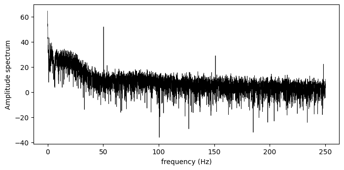
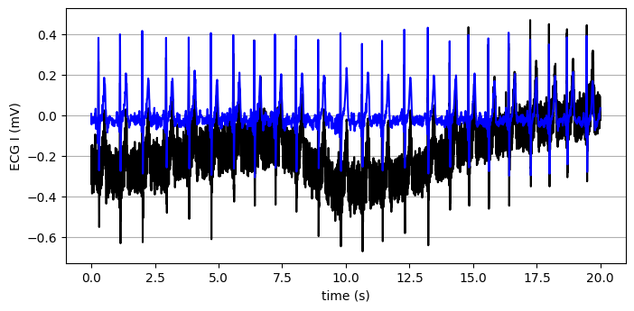

# Filtering

## Objective
Design and evaluate ECG filtering stages that reduce baseline drift and powerline-related contamination while preserving cardiac waveform morphology.

## Key Observation
The figures show progressive noise reduction in both time and frequency domains, with preserved P-QRS-T structure after zero-phase filtering.

## Overview
This report analyzes a raw Lead I ECG signal and applies a sequence of elliptic IIR filters to improve readability and spectral quality.

Signal source and setup:
- dataset: `ecgiddb_person02_rec1.csv`
- duration: `20 s`
- sampling frequency: `500 Hz`
- total samples: `10000`

Main disturbances targeted:
- baseline wandering concentrated at very low frequencies
- powerline interference around `50 Hz` and harmonics
- additional high-frequency noise components

## Method
### 1. Raw signal inspection
The raw ECG is inspected in time and frequency domains using waveform plots and FFT amplitude spectrum.

### 2. Baseline drift removal (high-pass)
An elliptic high-pass filter is designed with:
- passband edge: `0.5 Hz`
- stopband edge: `0.1 Hz`
- passband ripple: `0.1 dB`
- stopband attenuation: `80 dB`

This stage removes low-frequency baseline drift while preserving ECG content.

### 3. Powerline/noise suppression
Two strategies are compared.

Approach A: band-stop filter bank
- notch bands centered at `50, 100, 150, 200 Hz`
- selective suppression of mains harmonics

Approach B: low-pass alternative
- passband edge: `40 Hz`
- stopband edge: `42 Hz`
- passband ripple: `0.1 dB`
- stopband attenuation: `80 dB`

This approach is simpler and strongly attenuates 50 Hz contamination, but less selectively than notches.

### 4. Zero-phase filtering
All filtering stages use `filtfilt` (forward-backward), which avoids phase distortion and preserves timing/morphology of ECG landmarks.

## Results and Interpretation
### Raw ECG
The raw trace is physiologically plausible but affected by baseline drift and spectral contamination.

### After high-pass filtering
Baseline stability improves, and very-low-frequency spectral energy is substantially reduced.

### After powerline suppression
- Band-stop bank: cleaner spectrum around mains harmonics with good band preservation.
- High-pass + low-pass: broad cleanup and improved readability, at the cost of less selective attenuation.

### Time-domain comparison
Overlay plots show improved visual quality with preserved waveform structure:
- stable baseline
- clearer beats
- recognizable P-QRS-T morphology
- better suitability for downstream tasks (detection, feature extraction, classification)

## Discussion
This analysis highlights a practical ECG-filtering principle: remove noise without distorting clinically relevant morphology.

Main trade-offs:
- high-pass is effective for baseline wander
- notch/band-stop is selective for mains interference
- low-pass is simpler but broader in spectral impact
- zero-phase filtering is strongly preferred for morphology-sensitive signals

## Result Figures

Figure 1

Figure 2

Figure 3

Figure 4

Figure 5

Figure 6

Figure 7

Figure 8

Figure 9

Figure 10

## Conclusion
The filtering pipeline successfully improves ECG quality by reducing baseline drift and powerline-related noise while preserving morphology.

Key outcomes:
- spectral analysis clearly identifies dominant noise components
- elliptic IIR stages provide effective progressive cleanup
- zero-phase filtering preserves morphology and timing
- both filtering strategies improve the signal, with different selectivity-vs-simplicity trade-offs

The resulting ECG is better suited for reliable biomedical signal processing workflows.

