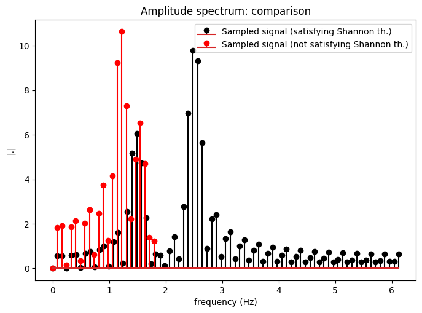

# Sampling Report

## Objective
Evaluate continuous-to-discrete sampling behavior and visually compare correct sampling versus aliasing-prone conditions.

## Method Summary
The notebook defines a continuous-time signal, samples it at different rates, and compares time/frequency-domain behavior.

## Key Observation
The figures show that higher sampling rates preserve the original signal shape, while lower rates introduce visible aliasing artifacts.

Execution status: `Success`

## Result Figures

Figure 1

Figure 2

Figure 3

