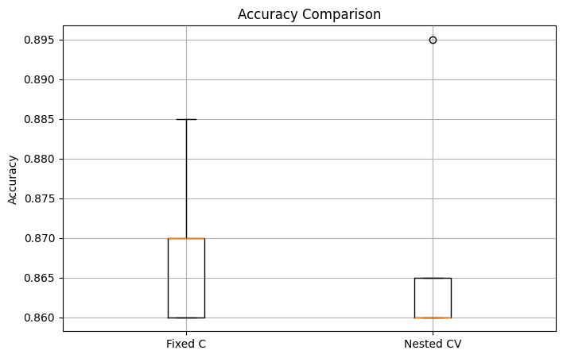
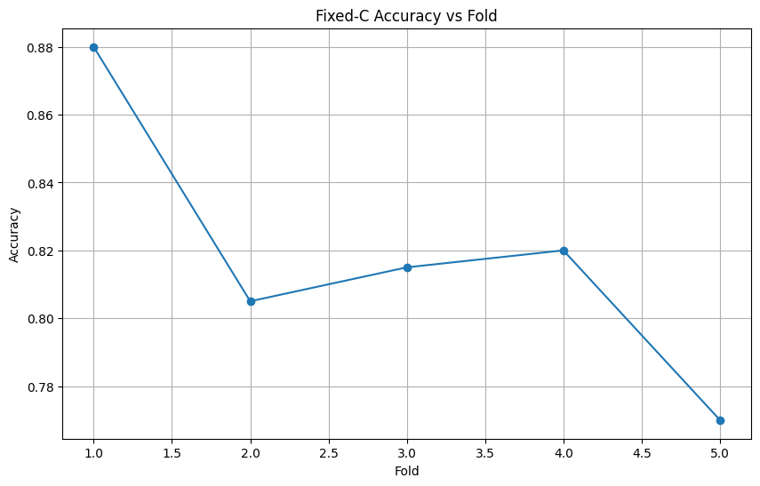
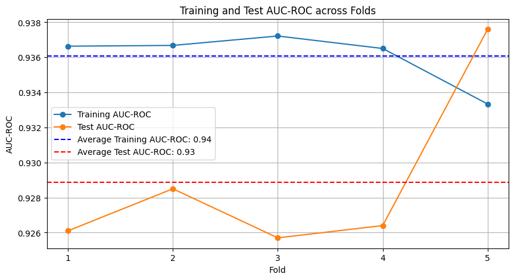
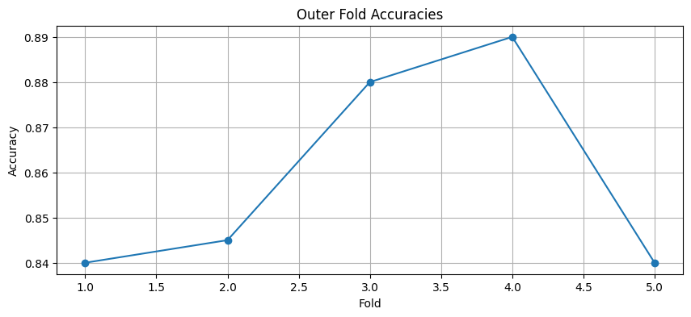
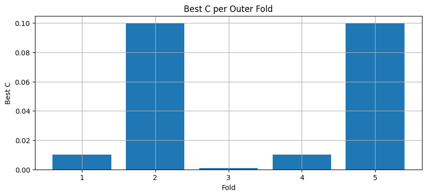

# Report

## `ML/Classification/classification_cross_validation_comparison.ipynb`

Execution status: `Success`

Result figures:

Figure 1

## `ML/Classification/classification_fixed_vs_nested_cv.ipynb`

Execution status: `Success`

Result figures:

Figure 1

## `ML/Classification/classification_logistic_auc_evaluation.ipynb`

Execution status: `Success`

Result figures:

Figure 1

## `ML/Classification/classification_nested_cross_validation_pipeline.ipynb`

Execution status: `Success`

Result figures:

Figure 1

Figure 2

