# Report

## `sampling_theorem_aliasing_demo.ipynb`

Execution status: `Success`

Result figures:

Figure 1

Figure 2

Figure 3

## `windowing_spectral_leakage_analysis.ipynb`

Execution status: `Success`

Result figures:

Figure 1
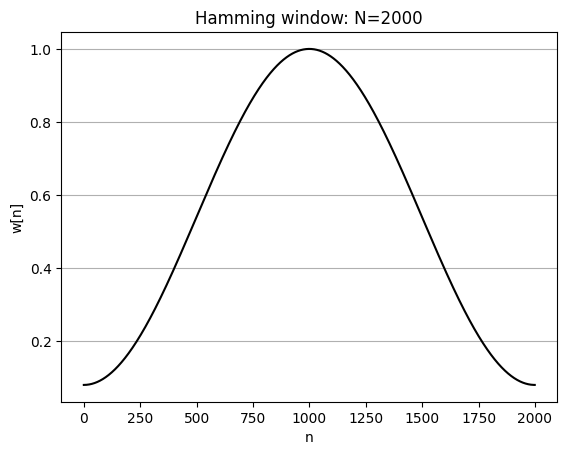

Figure 2
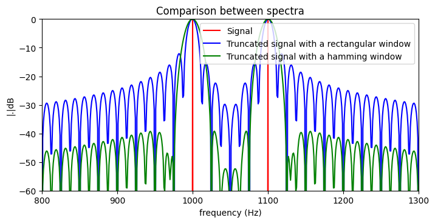

Figure 3
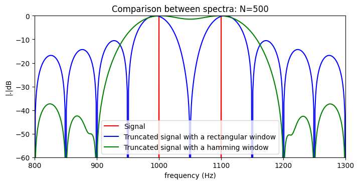

Figure 4
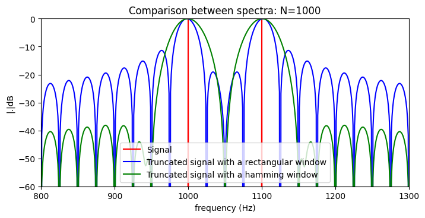

Figure 5
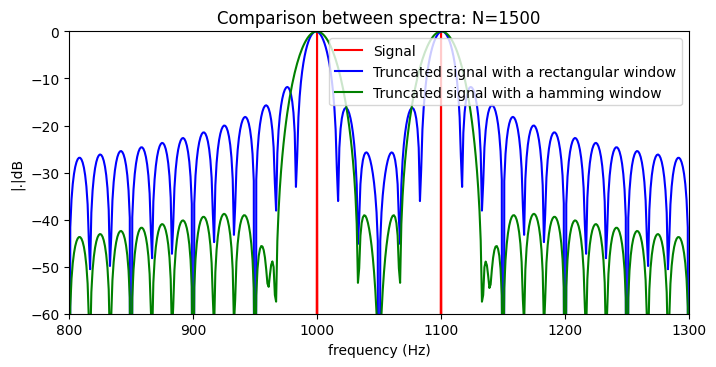

Figure 6
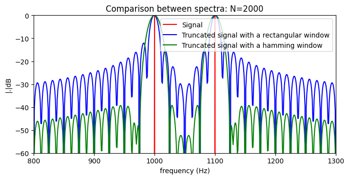

## `ecg_filter_design_analysis.ipynb`

Execution status: `Success`

Result figures:

Figure 1
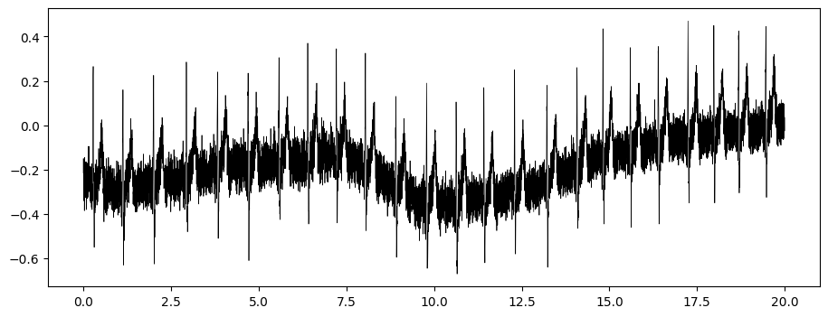

Figure 2

Figure 3
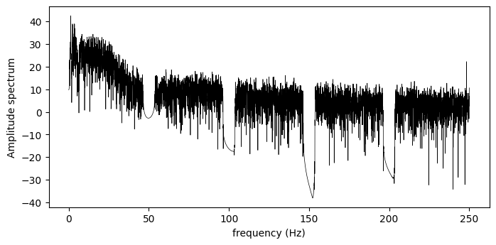

Figure 4
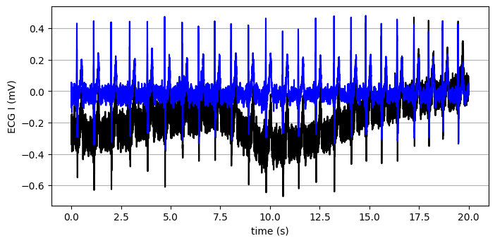

Figure 5
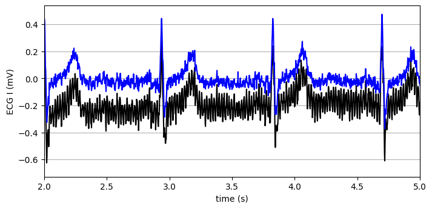

Figure 6

Figure 7
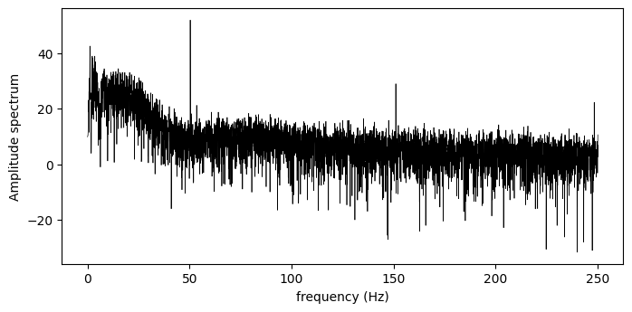

Figure 8
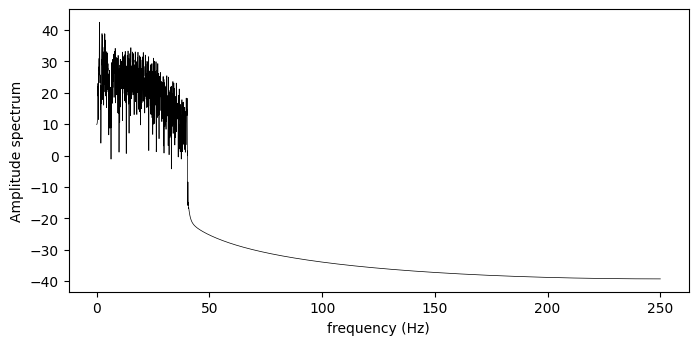

Figure 9

Figure 10
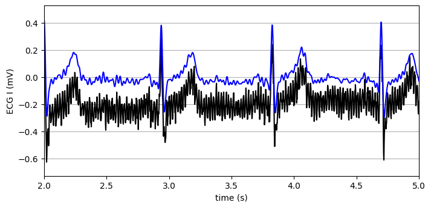
