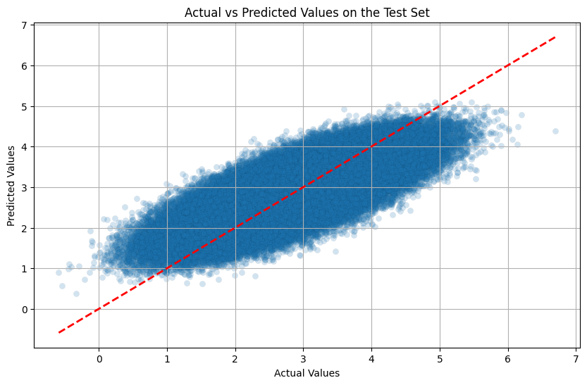
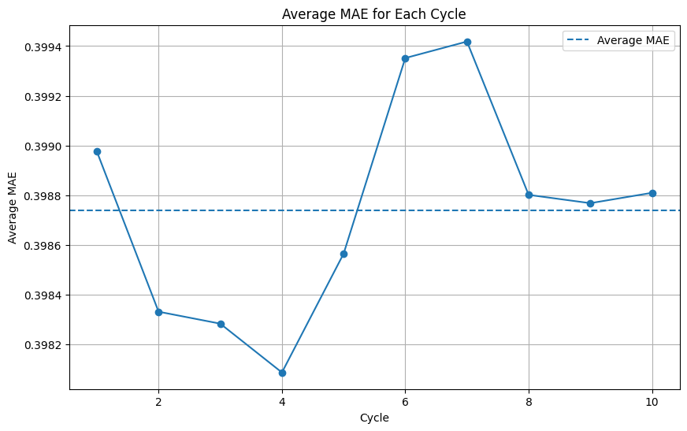
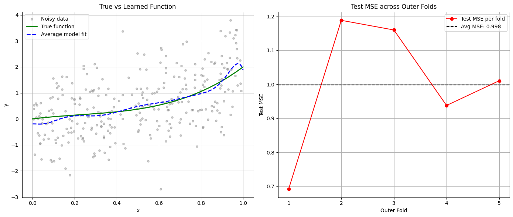

# Report

## `Regression/regression_holdout_validation.ipynb`

Execution status: `Success`

Result figures:

Figure 1

## `Regression/regression_repeated_kfold_cv.ipynb`

Execution status: `Success`

Result figures:

Figure 1

## `Regression/regression_nested_holdout_model_selection.ipynb`

Execution status: `Success`

Result figures: `No image output generated.`

## `Regression/regression_nested_cross_validation_polynomial.ipynb`

Execution status: `Success`

Result figures:

Figure 1

